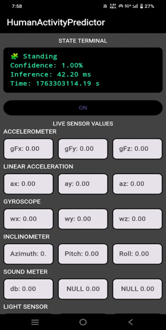
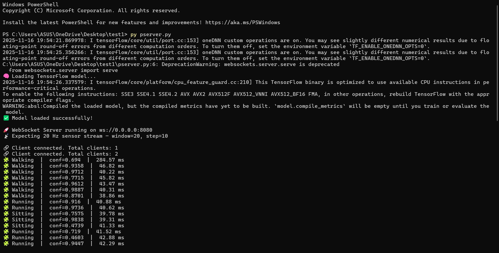

# HAR-Flutter-ML-App  
### Human Activity Recognition using Flutter & Machine Learning

## 📌 Project Overview
HAR-Flutter-ML-App is a mobile application designed to perform **real-time Human Activity Recognition (HAR)** using **IMU sensor data**. The app identifies daily human activities such as **walking, running, sitting, and standing** by leveraging a **Machine Learning model** integrated with a **Flutter-based mobile interface**.

The project demonstrates the practical use of **Machine Learning, Mobile Development, and Sensor Data Processing** to build an intelligent and responsive system.

---

## 🎯 Objectives
- To recognize human activities accurately using sensor data.
- To integrate Machine Learning predictions with a mobile application.
- To provide real-time activity classification using a lightweight and efficient system.
- To showcase the application of AI in healthcare and activity monitoring domains.

---

## 🛠️ Technologies Used
- **Flutter** – Mobile application development  
- **Python** – Machine Learning model development  
- **IMU Sensors** – Accelerometer & Gyroscope data collection  
- **Machine Learning Algorithms** – Activity classification  
- **WebSocket Communication** – Real-time data exchange  
- **GitHub** – Version control and project hosting  

---

## ⚙️ System Architecture
1. IMU sensors collect real-time motion data.
2. Sensor data is transmitted to the backend using WebSocket.
3. The Python-based ML model processes the data.
4. Predicted activity is sent back to the Flutter app.
5. The app displays the recognized activity to the user in real time.

---

## 📱 Features
- Real-time human activity recognition  
- Lightweight and responsive mobile UI  
- Accurate classification of common daily activities  
- Efficient sensor data handling  
- Scalable architecture for future enhancements  

---

## 🖼️ App Screenshots
  

---

## 🚀 Future Enhancements
- Add more activity classes (jumping, climbing stairs, cycling, etc.)
- Improve model accuracy using deep learning techniques
- Cloud-based model deployment
- Health analytics and activity history tracking
- Wearable device integration

---

## 👩‍💻 Author
**Shalini Kumari**  
- GitHub: https://github.com/Shalini154  
- Email: sharmashalini7198709@gmail.com  

---

## 📄 License
This project is developed for **academic and learning purposes**.  
Free to use and modify for educational use.
